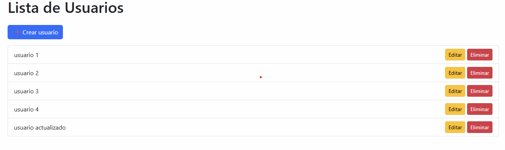

# 🧑‍💻 Sistema de Gestión de Usuarios - Django

Aplicación web desarrollada con Django que permite gestionar usuarios mediante operaciones CRUD (Crear, Listar, Editar y Eliminar).

---

## 🚀 Funcionalidades

* ✅ Crear usuarios desde la web
* 📋 Listar usuarios almacenados en base de datos
* ✏️ Editar usuarios
* ❌ Eliminar usuarios
* 🧠 Validación de datos con formularios de Django
* 🎨 Interfaz mejorada con Bootstrap

---

## 🛠️ Tecnologías utilizadas

* Python
* Django
* HTML
* Bootstrap
* SQLite

---

## 📸 Vista previa



---

## ⚙️ Instalación

1. Clonar el repositorio:

```bash
git clone https://github.com/esteban4012/django-usuarios-app.git
```

2. Entrar al proyecto:

```bash
cd django-usuarios-app
```

3. Crear entorno virtual:

```bash
python -m venv env
```

4. Activar entorno:

* Windows:

```bash
env\Scripts\activate
```

5. Instalar dependencias:

```bash
pip install django
```

6. Ejecutar migraciones:

```bash
python manage.py migrate
```

7. Ejecutar servidor:

```bash
python manage.py runserver
```

---

## 🎯 Objetivo del proyecto

Este proyecto fue desarrollado como parte de mi proceso de aprendizaje en desarrollo web backend con Django, con el objetivo de prepararme para mi primera experiencia laboral como desarrollador.

---

## 👨‍💻 Autor

Jorge Esteban Agudelo
